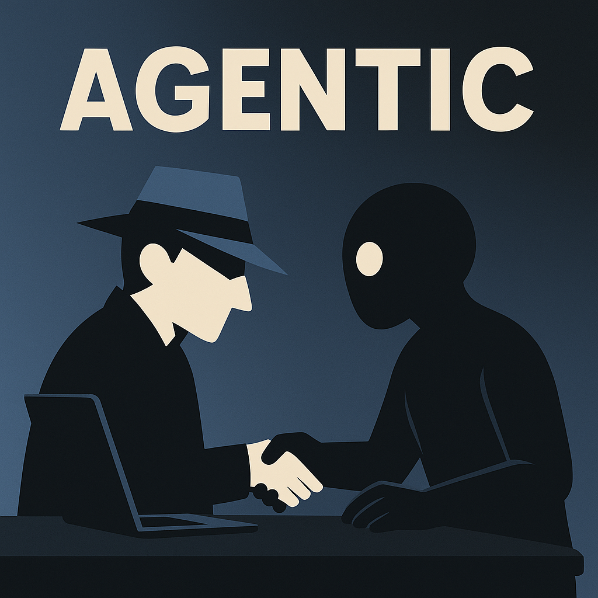

# Agentic CLI

> A secure, CLI-first AI development assistant for reproducible code generation

[](https://opensource.org/licenses/MIT)
[](https://www.python.org/downloads/)

## What is Agentic CLI?

<p align="left">
  
</p>
Agentic CLI is an AI-powered development assistant that helps you generate code, documentation, and configurations through natural language descriptions. Unlike other AI coding tools, Agentic CLI emphasizes:

- **Security First**: All AI-generated code runs in a sandbox before review
- **Human Control**: Every change requires explicit approval
- **Reproducibility**: Structured task templates ensure consistent outputs
- **Local-First**: Works entirely on your machine with optional cloud features

<div style='clear:both;'></div>

## Quick Start

```bash
# Install (when available)
pipx install agentic-cli

# Initialize a new project
agentic init --template=python

# Generate code from natural language
agentic generate "Create a FastAPI route for user authentication"

# Review the generated code
agentic review

# Apply approved changes
agentic apply
```

## Core Concepts

### Task Templates
Instead of free-form prompts, Agentic CLI uses structured task templates that define:
- Input parameters and validation
- Output file patterns and locations  
- Code quality checks and tests
- Context requirements

### Sandboxed Generation
All AI-generated code is created in `.agentic/preview/` where you can:
- Review changes before applying
- Run tests and validation
- Modify generated code
- Reject or approve changes

### Human-in-the-Loop
Every workflow includes human checkpoints:
1. **Generate**: AI creates code based on your description
2. **Review**: You examine the generated code and tests
3. **Apply**: You explicitly approve changes to your project

## Project Status

**🚧 Early Development**: This project is currently in the design and planning phase. The core concepts and architecture are being refined based on research and user feedback.

### Current Phase: MVP Definition
- [ ] Core CLI framework
- [ ] Basic code generation
- [ ] File system sandbox
- [ ] Task template system
- [ ] Human approval workflow

### Roadmap
- **Q1 2025**: MVP with basic code generation
- **Q2 2025**: Advanced context management and workflows
- **Q3 2025**: Community task library and integrations

## Architecture

```
┌─────────────────┐    ┌─────────────────┐    ┌─────────────────┐
│   CLI Gateway   │────│ Security Layer  │────│ Audit Logger    │
└─────────────────┘    └─────────────────┘    └─────────────────┘
         │                       │                       │
         v                       v                       v
┌─────────────────────────────────────────────────────────────────┐
│                   Core Orchestrator                             │
│  ┌───────────────┐  ┌───────────────┐  ┌─────────────────────┐ │
│  │ Agent Manager │  │Context Engine │  │ Task Registry       │ │
│  └───────────────┘  └───────────────┘  └─────────────────────┘ │
└─────────────────────────────────────────────────────────────────┘
         │                       │                       │
         v                       v                       v
┌─────────────────┐    ┌─────────────────┐    ┌─────────────────┐
│ Generator Agent │    │ Reviewer Agent  │    │ LLM Providers   │
└─────────────────┘    └─────────────────┘    └─────────────────┘
```

## Security Model

Agentic CLI implements multiple security layers:

- **Input Sanitization**: All user inputs are validated and sanitized
- **Sandboxed Execution**: Generated code cannot access your filesystem directly
- **Output Validation**: All generated code is scanned for potential issues
- **Audit Trail**: Every operation is logged for review and debugging
- **Explicit Approval**: No changes are applied without your consent

## Contributing

This project is in early development. We welcome:

- **Feedback** on the core concepts and architecture
- **Use Case Examples** to help define the MVP scope
- **Security Review** of the proposed architecture
- **Technical Discussion** on implementation approaches

## Documentation

- [Product Requirements Document (PRD)](PRD.md) - Product vision and requirements
- [Software Design Document (SDD)](SDD.md) - Technical architecture and design
- [Claude Context (CLAUDE.md)](CLAUDE.md) - AI assistant context and guidelines

## License

MIT License - see [LICENSE](LICENSE) for details.

## Frequently Asked Questions

**Q: How is this different from GitHub Copilot or Cursor?**
A: Agentic CLI focuses on structured, reproducible workflows with explicit human approval for all changes. Instead of inline suggestions, it generates complete solutions that you review and approve.

**Q: Why CLI-first instead of IDE integration?**
A: CLI tools are universal, scriptable, and integrate with any development environment. You can use Agentic CLI with VS Code, Vim, IntelliJ, or any other editor.

**Q: What about data privacy?**
A: Agentic CLI is designed to work locally by default. When using cloud LLM providers, only the minimal context needed for generation is sent, never your entire codebase.

**Q: When will this be available?**
A: We're currently in the design phase, validating core concepts and gathering feedback. An early MVP is planned for Q1 2025.

---

*"The best tools disappear into the work. They amplify intention without adding noise, extend capability without creating dependency, and serve the user's goals without imposing their own agenda."*