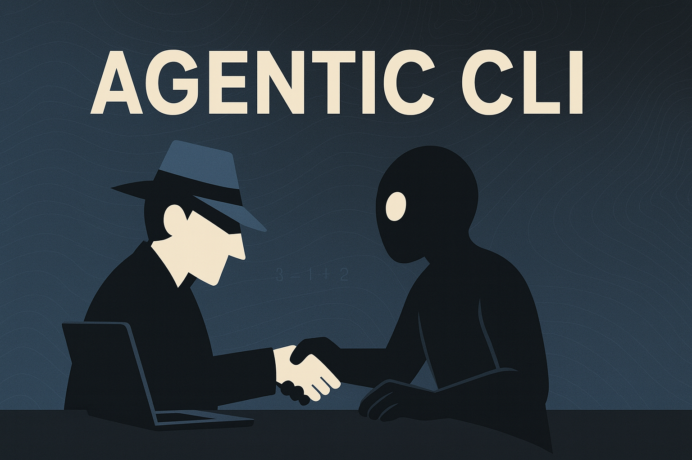

# Agentic CLI

> A CLI-first AI development assistant focused on security and human oversight

[](https://opensource.org/licenses/MIT)
[](https://www.python.org/downloads/)



## What is Agentic CLI?

Agentic CLI is an experimental AI development assistant that takes a different approach: instead of inline suggestions, it generates code in a sandbox where you can review and approve changes before they touch your project.

## Key Ideas

- **Safety First**: Generated code runs in `.agentic/preview/` - nothing changes without your approval
- **Structured Tasks**: Uses YAML templates instead of free-form prompts for consistency
- **Local Control**: Works locally by default, sends minimal context to LLMs
- **Audit Trail**: Logs what was generated and what you approved
- **Human Decisions**: You're always in control of what gets applied


## Current Status & Quick Start

**⚠️ Early Development**: This is a working prototype. The core CLI works, but many features are still being built.

```bash
# Not yet published - install from source
git clone https://github.com/yourusername/agentic-cli
cd agentic-cli
poetry install

# Initialize project
agentic init

# Generate code (uses built-in task templates)
agentic generate python_function name=hello return_value="world"

# Review what was generated
agentic review

# Apply if you like it
agentic apply
```

## Core Concepts

### Task Templates
Instead of free-form prompts, Agentic CLI uses structured task templates that define:
- Input parameters and validation
- Output file patterns and locations  
- Code quality checks and tests
- Context requirements

### Sandboxed Generation
All AI-generated code is created in `.agentic/preview/` where you can:
- Review changes before applying
- Run tests and validation
- Modify generated code
- Reject or approve changes

### Human-in-the-Loop
Every workflow includes human checkpoints:
1. **Generate**: AI creates code based on your description
2. **Review**: You examine the generated code and tests
3. **Apply**: You explicitly approve changes to your project

## Project Status

### What Works Right Now
- [x] CLI framework (`agentic init`, `generate`, `review`, `apply`)
- [x] Sandbox system (files go to `.agentic/preview/`)
- [x] Basic task templates (python_function, readme, fastapi_route)
- [x] LLM integration (OpenAI, with mock provider for testing)
- [x] Human approval workflow

### What's Being Built
- [ ] More task templates
- [ ] Better conflict resolution
- [ ] Enhanced security scanning
- [ ] Documentation improvements

### Maybe Someday
- [ ] Enterprise features (if there's demand)
- [ ] More LLM providers
- [ ] IDE integrations

## Architecture

```
┌─────────────────┐    ┌─────────────────┐    ┌─────────────────┐
│   CLI Gateway   │────│ Security Layer  │────│ Audit Logger    │
└─────────────────┘    └─────────────────┘    └─────────────────┘
         │                       │                       │
         v                       v                       v
┌─────────────────────────────────────────────────────────────────┐
│                   Core Orchestrator                             │
│  ┌───────────────┐  ┌───────────────┐  ┌─────────────────────┐ │
│  │ Agent Manager │  │Context Engine │  │ Task Registry       │ │
│  └───────────────┘  └───────────────┘  └─────────────────────┘ │
└─────────────────────────────────────────────────────────────────┘
         │                       │                       │
         v                       v                       v
┌─────────────────┐    ┌─────────────────┐    ┌─────────────────┐
│ Generator Agent │    │ Reviewer Agent  │    │ LLM Providers   │
└─────────────────┘    └─────────────────┘    └─────────────────┘
```

## Security Model

Agentic CLI implements multiple security layers:

- **Input Sanitization**: All user inputs are validated and sanitized
- **Sandboxed Execution**: Generated code cannot access your filesystem directly
- **Output Validation**: All generated code is scanned for potential issues
- **Audit Trail**: Every operation is logged for review and debugging
- **Explicit Approval**: No changes are applied without your consent

## Contributing

This project is in early development. We welcome:

- **Feedback** on the core concepts and architecture
- **Use Case Examples** to help define the MVP scope
- **Security Review** of the proposed architecture
- **Technical Discussion** on implementation approaches

## Documentation

- [Product Requirements Document (PRD)](PRD.md) - Product vision and requirements
- [Software Design Document (SDD)](SDD.md) - Technical architecture and design
- [Claude Context (CLAUDE.md)](CLAUDE.md) - AI assistant context and guidelines

## License

MIT License - see [LICENSE](LICENSE) for details.

## Frequently Asked Questions

**Q: How is this different from GitHub Copilot or Cursor?**
A: Different approach - instead of inline suggestions, it generates complete files in a sandbox where you review before applying. More explicit, less magical.

**Q: Is this production ready?**
A: No, it's a prototype. The core workflow works but there are rough edges and missing features.

**Q: Why build another AI coding tool?**
A: Experimenting with a more structured, security-conscious approach. Might be useful for teams that want more control over AI-generated code.

**Q: Can I use it now?**
A: You can try it, but expect bugs and missing features. It's in active development.

---

*"The best tools disappear into the work. They amplify intention without adding noise, extend capability without creating dependency, and serve the user's goals without imposing their own agenda."*